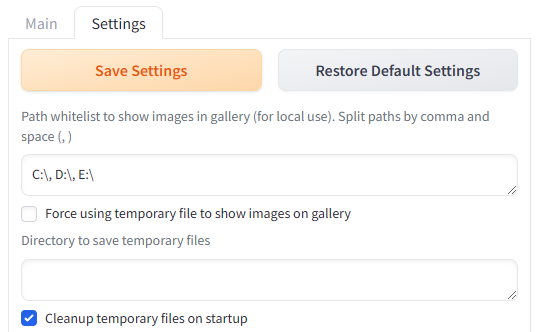
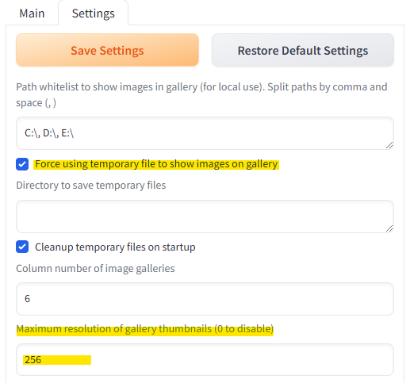

# Dataset Tag Editor Standalone

[English Readme](README.md)

web UI 上で学習用データセットのキャプションを編集できるようにします。  
こちらは、[Dataset Tag Editor](https://github.com/toshiaki1729/stable-diffusion-webui-dataset-tag-editor)のスタンドアロン版です（元のプログラムは[Stable Diffusion web UI by AUTOMATIC1111](https://github.com/AUTOMATIC1111/stable-diffusion-webui)用の拡張機能です）。


DeepBooru interrogator で生成したような、カンマ区切り形式のキャプションを編集するのに適しています。

キャプションとして画像ファイル名を利用している場合も読み込むことができますが、保存はテキストファイルのみ対応しています。


## 拡張機能版との違い
(Pros)  
- gradioの特定のバージョンに起因するバグの回避
- 起動と動作がより早く

(Cons)
- SD webUI用に改造されたCLIPが使えません (TIや強調などの機能)
- 古い Python < 3.9 をサポートしません


## Requirements
要件は `requirements.txt` に全て記載されています。  

**以下をはじめにインストールしてください。**
- [Python](https://www.python.org/) >= 3.9 (3.10.11で開発しています)  
- [PyTorch](https://pytorch.org/) with CUDA >= 1.10.0 ([TorchDeepDanbooru](https://github.com/AUTOMATIC1111/TorchDeepDanbooru)が使用する[onnx-pytorch](https://github.com/fumihwh/onnx-pytorch)の要件)  
PyTorchのバージョンは[transformers](https://github.com/huggingface/transformers)に依存しています。手動で特定のバージョンをインストールする場合は [transformersのインストールの説明](https://github.com/huggingface/transformers#installation)に従ってください。

DirectMLを使用する際は、venvに手動でインストールしてください ([pytorch-directml](https://pypi.org/project/pytorch-directml/)をインストールすると有効化されます)。ただし私toshiaki1729の環境ではテストができない為、動作の保証はできません。


## インストール方法
### Windows
`install.bat`を起動してください。  

### Linux (またはWindowsで手動でインストールするとき)
このリポジトリのルートディレクトリで、以下のコマンドを実行してください。
```sh
python3 -m venv --system-site-packages venv
source ./venv/bin/activate
pip3 install -r requirements.txt
```
(Note: Windowsでのvenvの有効化は `.\venv\Scripts\activate` と読み替えてください。)


## 起動方法
`-h` または `--help` をコマンドライン引数に指定することで、利用可能なコマンドライン引数の一覧を取得できます。

### Windows
`launch_user.bat` を起動してください。

### Linux
```sh
source ./venv/bin/activate
python scripts/launch.py [arguments]
```

### Google Colab

Google Colabユーザーは、以下のコマンドを実行し、生成されたGradioのPublic URLにアクセスすることで利用できます。  
(おそらく、これは現在Colab Proでのみ利用可能だと思います)。

```sh
%cd /content
!git clone https://github.com/toshiaki1729/dataset-tag-editor-standalone.git
%cd /content/dataset-tag-editor-standalone
!pip install -r requirements.txt
!python scripts/launch.py --share
```

## 特徴
以下、「タグ」はカンマ区切りされたキャプションの各部分を意味します。
- テキスト形式（webUI方式）またはjson形式 ([kohya-ss sd-scripts metadata](https://github.com/kohya-ss/sd-scripts))のキャプションを編集できます
- 画像を見ながらキャプションの編集ができます
- タグの検索ができます
- 複数タグで絞り込んでキャプションの編集ができます
  - 絞り込み方法として、AND/OR/NOT検索ができます
- タグを一括で置換・削除・追加できます
- タグを一括で並べ替えできます
- タグまたはキャプション全体について一括置換ができます
  - [正規表現](https://docs.python.org/ja/3/library/re.html#regular-expression-syntax) が利用可能です
- Interrogatorを使用してタグの追加や編集ができます
  - BLIP、DeepDanbooru、[Z3D-E621-Convnext](https://huggingface.co/toynya/Z3D-E621-Convnext)、 [WDv1.4 Tagger](https://huggingface.co/SmilingWolf)の各ネットワークによる学習結果（v1, v2, v3）が使用可能です
- お好みのTaggerを `userscripts/taggers` に追加できます (`scripts.tagger.Tagger`を継承したクラスでラップしてください)
  - 当該フォルダにAesthetic Scoreに基づいたTaggerをいくつか実装しています
- 画像やキャプションファイルの一括移動・削除ができます


## 使い方
1. データセットを作成する
    - 既にリサイズ・トリミングされた画像を使用することをお勧めします
1. データセットを読み込む
    - 必要に応じてDeepDanbooru等でタグ付けができます
1. キャプションを編集する
    - "Filter by Tags" タブでキャプションの編集をしたい画像を絞り込む
    - 画像を手動で選んで絞り込む場合は "Filter by Selection" タブを使用する
    - 一括でタグを置換・削除・追加する場合は "Batch Edit Caption" タブを使用する
    - キャプションを個別に編集したい場合は "Edit Caption of Selected Image" タブを使用する
      - DeepDanbooru等も利用可能
    - 選択したものをデータセットから一括移動・削除したい場合は "Remove or Delete Files" タブを使用する
1. "Save all changes" ボタンをクリックして保存する


## タグ編集の手引き

基本的な手順は以下の通りです

1. 編集対象の画像をフィルターで絞り込む
1. まとめて編集する

一括で行われる編集はすべて**表示されている画像（＝絞り込まれた画像）にのみ**適用されます。

### 1. フィルターの選び方
- **全ての画像を一括で処理したい場合**  
  フィルターは不要です。
- **何枚かを処理したい場合**  
  1. **共通のタグや、共通して持たないタグがある**  
    "Filter by Tags" タブで画像を絞り込み、編集対象だけが表示されるようにする。
  1. **何も共通点が無い**  
    "Filter by Selection" タブで画像を絞り込む。 
    フィルターへの画像の追加は[Enter]キーがショートカットです。

### 2. 編集の仕方
- **新しいタグを追加したい場合**
  1. "Batch Edit Captions" タブを開く
  1. "Edit tags" 内に追加したいタグをカンマ区切りで追記する
  1. "Apply changes to filtered images" ボタンを押す
    
  例："foo" と "bar" が表示されている画像に追加されます

- **絞り込まれた画像に共通なタグを編集（置換）したい場合**
  1. "Batch Edit Captions" タブを開く
  1. "Edit tags" 内に表示されたタグを書き換える
  1. "Apply changes to filtered images" ボタンを押す
    
  例："male focus" と "solo" がそれぞれ "foo" と "bar" に置換されます

- **タグを取り除きたい場合**  
  置換と同様の手順で、対象のタグを空欄に書き換えることで取り除けます。  
  共通のタグでない（一部の画像にのみ含まれる等）場合は、"Batch Edit Captions" タブにある "Remove" を利用することもできます。

- **柔軟にタグを追加・削除・置換したい場合**
  1. "Batch Edit Captions" タブを開く
  2. "Use regex" にチェックを入れて "Search and Replace" する  
    
  例："1boy", "2boys", … がそれぞれ、 "1girl", "2girls", … に置換されます。  
  カンマはタグの区切りとみなされるため、カンマを追加・削除することで新しいタグを追加・削除できます。  
  正規表現（regex）を使うと、複雑な条件に応じてタグの編集が可能です。


## トラブルシューティング
### ギャラリーに画像が表示されず、コンソールにエラーが表示されない
(おそらくv0.0.6以降)  
このプログラムのあるフォルダ以外から画像を読み込む場合は、"Settings" タブで、画像の読み取りを許可するフォルダを指定する、もしくは、下の項目と同様の方法で、サムネイル画像を一時保存するフォルダを指定してください。  
"Path whitelist to show images …" にパスを指定します。  
子フォルダに全て適用されるため、ドライブ名を"C:\\"のように指定すると、Cドライブの全てに対して読み取りを許可します。  
 

### ギャラリーに画像が表示されず、コンソールに "All files must contained within the Gradio python app working directory…" と出ている
(おそらくv0.0.5以前)  
"Settings" タブで、サムネイル画像を一時保存するフォルダを指定してください。  
"Directory to save temporary files" にパスを指定して "Force using temporary file…" をチェックしてください。  

### 大量の画像や巨大な画像を開いたときに動作が遅くなる
"Settings" タブで、"Force using temporaty file to ..." にチェックを入れて、 "Maximum resolution of ..." に希望の解像度を入れてください。  
数百万もの画像を含むなど、あまりにも巨大なデータセットでは効果がないかもしれません。  
 

### PyTorch が CUDA を使っていない
- 他のスクリプトと共有するために PyTorch をシステムにインストールする場合
  1. [PyTorchのインストール方法](https://pytorch.org/get-started/locally/) に従って、ただし`-U` (`--upgrade`) をつけてインストールする  
  (例) ```pip3 install -U torch torchvision --index-url https://download.pytorch.org/whl/cu118```
  1. `venv` フォルダを削除する
  1. `install.bat` を実行する
- PyTorch を venv のみにインストールする場合
  1. `launch_user.bat` をテキストエディタで開く
  2. 3行目を `set COMMANDLINE_ARGS="--force-install-torch cu118"` に変える  
  (`cu117`、`cu118`、`cu121` または `cpu` から選べます)
  3. `launch_user.bat` を実行する
  4. (付け足したコマンドライン引数を削除する)
