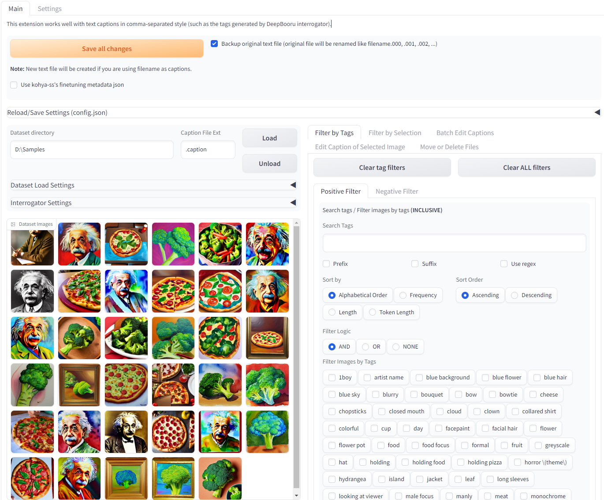
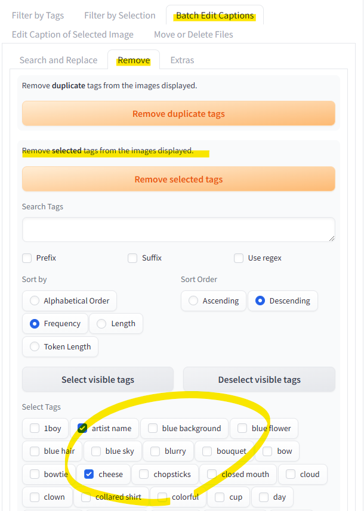

# Dataset Tag Editor Standalone (WIP)

[日本語 Readme](README-JP.md)

This is a WebUI tool to edit training dataset for Text2Image Models.  
This is a standalone version of [Dataset Tag Editor](https://github.com/toshiaki1729/stable-diffusion-webui-dataset-tag-editor), which is an extension for [Stable Diffusion web UI by AUTOMATIC1111](https://github.com/AUTOMATIC1111/stable-diffusion-webui). 



It works well with text captions in comma-separated style (such as the tags generated by DeepDanbooru interrogator).

Caption in the filenames of images can be loaded, but edited captions can only be saved in the form of text files.

## Difference from the Extension Version
(Pros)  
- Avoid bugs caused by specific version of gradio
- Much faster startup and running
- More captioning interrogators ([GIT](https://huggingface.co/docs/transformers/model_doc/git) ([paper (arXiv)](https://arxiv.org/abs/2205.14100)), [BLIP-2](https://huggingface.co/docs/transformers/model_doc/blip-2) ([paper (arXiv)](https://arxiv.org/abs/2301.12597)): may extremely heavy)

(Cons)
- Hijacked CLIP tokenizer is not available (which has SDwebUI specific features like embedding, emphasis, …)
- No more support for old Python < 3.9


## Requirements
All requirements are listed in `requirements.txt`  


**Please install the followings first:**  
- [Python](https://www.python.org/) >= 3.9 (Developed on 3.10.11)  
- [PyTorch](https://pytorch.org/) with CUDA >= 1.10.0 ([onnx-pytorch](https://github.com/fumihwh/onnx-pytorch) requirement; for [TorchDeepDanbooru](https://github.com/AUTOMATIC1111/TorchDeepDanbooru))  
PyTorch version mostly depends on [transformers](https://github.com/huggingface/transformers), please follow [the instruction to install transformers](https://github.com/huggingface/transformers#installation) if install specific version manually.

If you want to use DirectML, please install manually in venv  (install [pytorch-directml](https://pypi.org/project/pytorch-directml/) to enable, **not tested**).


## Installation
### Windows
Just run `install.bat`  

### Linux (or install manually on Windows)
Run following commands on the root directory of this repo.
```sh
python -m venv --system-site-packages venv
source ./venv/Scripts/activate
pip install -r requirements.txt
```
(Note: just `.\venv\Scripts\activate` is needed to activate venv on Windows)


## Launch
You can see available command line args with `-h` or `--help` option.

### Windows
Just run `launch_user.bat`

### Linux
```sh
source ./venv/Scripts/activate
python scripts/launch.py [arguments]
```


## Features
Note. "tag" means each blocks of caption separated by commas.
- Edit and save captions in text file (webUI style) or json file ([kohya-ss sd-scripts metadata](https://github.com/kohya-ss/sd-scripts))
- Edit captions while viewing related images
- Search tags
- Filter images to edit their caption by tags
  - AND/OR logic can be used in each Positive/Negative filters
- Batch replace/remove/append tags
- Batch sort tags
- Batch search and replace
  - [regular expression](https://docs.python.org/3/library/re.html#regular-expression-syntax) can be used
- Use interrogators
  - BLIP, BLIP2, GIT, DeepDanbooru, SmilingWolf's [WDv1.4 Tagger](https://huggingface.co/SmilingWolf) (v1, v2 and some variants of them)
- Batch remove image and/or caption files


## Usage
1. Make dataset
    - better to use already cropped images
1. Load them
    - use interrogator if needed
1. Edit their captions
    - filter images you want to edit by tags in "Filter by Tags" tab
    - filter images manually in "Filter by Selection" tab
    - replace/remove tags or append new tags in "Batch Edit Captions" tab
    - edit captions individually in "Edit Caption of Selected Image" tab
      - you also can use interrogator here
    - move/delete files in "Move or Delete Files" tab if needed
1. Click "Save all changes" button


## By the way, how can I edit tags quickly?

Basic workflow is as follows:

1. Filter images
1. Batch edit

Please note that all batch editing will be applyed **only to displayed images (=filtered images)**.

### 1. Which filter is appropriate?
- **I want to edit all at once**  
  No filter is required.
- **Some images require editing**  
  1. **They should / shouldn't already have same tag(s)**  
    Go to "Filter by Tags" so that the only images to be edited are displayed.
  1. **They have nothing in common**  
    Go to "Filter by Selection" and apply.  
    Images can also be added to the filter by pushing [Enter] key.

### 2. How can I edit as I want?
- **I want to add some new tags**
  1. Go to "Batch Edit Captions" tab
  1. Append tags to "Edit tags" textbox
  1. Push "Apply changes to filtered images" button  
    
  "foo" and "bar" will be added to all images displayed.

- **I want to replace the tags which are common to displayed images**
  1. Go to "Batch Edit Captions" tab
  1. Replace tags in "Edit tags" textbox
  1. Push "Apply changes to filtered images" button  
    
  "male focus" and "solo" will be replaced with "foo" and "bar".

- **I want to remove some tags**  
  The same as replacing. Just replace the tags with "blank".  
  Also you can use "Remove" tab in "Batch Edit Captions".

- **I want to add/replace/remove tags more flexibly**
  1. Go to "Batch Edit Captions" tab
  2. Use "Search and Replace" with "Use regex" checked  
    
  "1boy", "2boys", … will be replaced with "1girl", "2girls", … in each tags of images displayed.  
  A comma will be regarded as the sepalator of two tags.  
  By using regex, you can add/replace/remove tags according to more complex conditions.


## Trouble shooting
### Cannot see any image in dataset and saying "All files must contained within the Gradio python app working directory…"
Set folder to store temporaly image in the "Settings" tab.
Input path in "Directory to save temporary files" and check "Force using temporary file…"

### My PyTorch is working without CUDA
Choose one from the followings
- Install PyTorch in your system to share
  1. Follow [the PyTorch installation guide](https://pytorch.org/get-started/locally/) with -U (--upgrade) option  
  (example) ```pip3 install -U torch torchvision --index-url https://download.pytorch.org/whl/cu118```
  1. Remove `venv` folder
  1. Run `install.bat`
- Install PyTorch only in venv
  1. Open `launch_user.bat` with some text editor
  2. Change the 3rd line to `set COMMANDLINE_ARGS="--force-install-torch cu118"` (you can choose from `cu117`, `cu118` or `cpu`)
  3. Run `launch_user.bat`
  4. (Remove the command line argument)